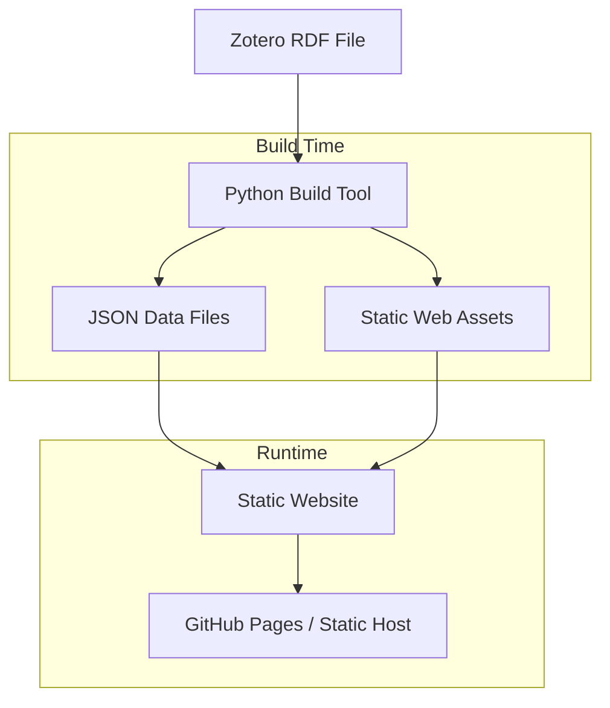
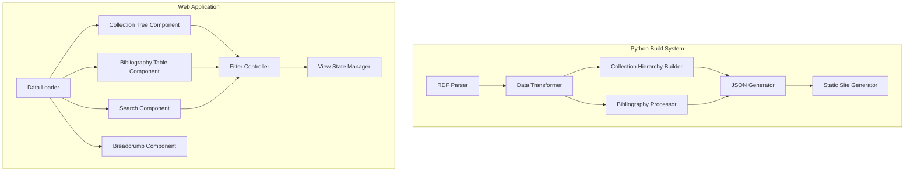

# Design Document

## Overview

The Literature Collection Webviewer is a static website generator that transforms Zotero RDF exports into an interactive web interface. The system consists of two main components: a Python-based build tool that processes RDF data and generates static assets, and a client-side web application that provides dynamic browsing, searching, and filtering capabilities.

The architecture follows a build-time data processing approach where all RDF parsing and data transformation occurs during the build phase, producing optimized JSON data files and static web assets that can be deployed to any static hosting platform.

## Architecture

### High-Level Architecture



### Component Architecture



## Components and Interfaces

### Python Build System Components

#### RDF Parser
- **Purpose**: Parse Zotero RDF files and extract structured data
- **Dependencies**: `rdflib` for RDF parsing
- **Input**: Zotero RDF file path
- **Output**: Raw RDF graph data
- **Key Methods**:
  - `parse_rdf_file(file_path: str) -> Graph`
  - `extract_items(graph: Graph) -> List[Dict]`
  - `extract_collections(graph: Graph) -> List[Dict]`

#### Data Transformer
- **Purpose**: Convert raw RDF data into normalized bibliography and collection data
- **Input**: Raw RDF graph data
- **Output**: Structured dictionaries for items and collections
- **Key Methods**:
  - `transform_bibliography_item(item: Dict) -> BibliographyItem`
  - `normalize_authors(authors: List) -> List[Author]`
  - `extract_metadata(item: Dict) -> Dict`

#### Collection Hierarchy Builder
- **Purpose**: Build hierarchical collection structure from flat collection data
- **Input**: List of collection dictionaries
- **Output**: Nested collection tree structure
- **Key Methods**:
  - `build_hierarchy(collections: List[Dict]) -> CollectionTree`
  - `assign_items_to_collections(items: List, collections: List) -> None`

#### Static Site Generator
- **Purpose**: Generate HTML, CSS, and JavaScript files for the web interface
- **Dependencies**: `jinja2` for templating
- **Input**: Processed data structures
- **Output**: Complete static website
- **Key Methods**:
  - `generate_html_template() -> str`
  - `generate_css_styles() -> str`
  - `generate_javascript_app() -> str`

### Web Application Components

#### Data Loader
- **Purpose**: Load and initialize JSON data on the client side
- **Technology**: Vanilla JavaScript (ES6+)
- **Responsibilities**:
  - Fetch JSON data files
  - Initialize application state
  - Handle loading states and errors

#### Collection Tree Component
- **Purpose**: Render and manage the hierarchical collection navigation
- **Features**:
  - Expandable/collapsible tree nodes
  - Selection highlighting
  - Lazy loading for large hierarchies
- **Events**: Collection selection, tree expansion/collapse

#### Bibliography Table Component
- **Purpose**: Display literature items in a sortable, filterable table
- **Features**:
  - Column sorting (title, authors, year, venue)
  - Pagination or virtual scrolling
  - Responsive design for mobile devices
- **Events**: Sort column clicks, item selection

#### Search Component
- **Purpose**: Provide real-time search functionality
- **Features**:
  - Full-text search across multiple fields
  - Search highlighting in results
  - Search history and suggestions
- **Search Fields**: Title, authors, abstract, keywords, venue

#### Filter Controller
- **Purpose**: Coordinate filtering between collection selection and search
- **Responsibilities**:
  - Combine collection and search filters
  - Update table display based on active filters
  - Maintain filter state in URL parameters

## Data Models

### BibliographyItem
```typescript
interface BibliographyItem {
  id: string;
  type: 'article' | 'book' | 'conference' | 'thesis' | 'other';
  title: string;
  authors: Author[];
  year: number;
  venue: string;
  abstract?: string;
  doi?: string;
  url?: string;
  keywords: string[];
  collections: string[];
  attachments: Attachment[];
}
```

### Author
```typescript
interface Author {
  givenName: string;
  surname: string;
  fullName: string;
}
```

### Collection
```typescript
interface Collection {
  id: string;
  title: string;
  parentId?: string;
  children: Collection[];
  itemIds: string[];
  itemCount: number;
}
```

### Attachment
```typescript
interface Attachment {
  id: string;
  title: string;
  type: string;
  url?: string;
}
```

## Technology Stack

### Build System
- **Python 3.9+**: Core language for build tools
- **uv**: Dependency management and project tooling
- **rdflib**: RDF parsing and SPARQL queries
- **jinja2**: HTML template generation
- **click**: Command-line interface

### Web Frontend
- **HTML5**: Semantic markup structure
- **CSS3**: Styling with CSS Grid and Flexbox
- **Vanilla JavaScript (ES6+)**: Client-side functionality
- **No framework dependencies**: Keeps the static site lightweight

### Data Format
- **JSON**: Client-side data format for bibliography and collections
- **Optimized structure**: Separate files for large datasets to enable lazy loading

## File Structure

```
literature-webviewer/
├── src/
│   ├── rdf_parser.py
│   ├── data_transformer.py
│   ├── collection_builder.py
│   ├── site_generator.py
│   └── cli.py
├── templates/
│   ├── index.html
│   ├── styles.css
│   └── app.js
├── output/
│   ├── index.html
│   ├── styles.css
│   ├── app.js
│   ├── data/
│   │   ├── bibliography.json
│   │   └── collections.json
│   └── assets/
├── pyproject.toml
└── README.md
```

## Error Handling

### Build-Time Error Handling
- **RDF Parsing Errors**: Graceful handling of malformed RDF with detailed error messages
- **Missing Data**: Default values for optional fields, warnings for critical missing data
- **File I/O Errors**: Clear error messages for file access issues
- **Validation**: Schema validation for generated JSON data

### Runtime Error Handling
- **Network Errors**: Retry logic for data loading with user feedback
- **Data Loading**: Progressive loading with fallbacks for large datasets
- **Browser Compatibility**: Feature detection and graceful degradation
- **Search Performance**: Debouncing and result limiting for large collections

## Performance Considerations

### Build Performance
- **Incremental Processing**: Only rebuild when source RDF changes
- **Memory Management**: Stream processing for large RDF files
- **Parallel Processing**: Multi-threaded processing for large collections

### Runtime Performance
- **Data Loading**: Lazy loading of large datasets
- **Search Optimization**: Indexed search with debounced queries
- **Virtual Scrolling**: For tables with thousands of items
- **Caching**: Browser caching for static assets and data files

## Testing Strategy

### Unit Testing
- **RDF Parser**: Test with various Zotero export formats
- **Data Transformer**: Validate data normalization and edge cases
- **Collection Builder**: Test hierarchy construction with complex nesting
- **Site Generator**: Verify output file generation and templating

### Integration Testing
- **End-to-End Build**: Test complete RDF-to-website pipeline
- **Data Integrity**: Verify no data loss during transformation
- **Cross-Browser**: Test web interface across major browsers

### Performance Testing
- **Large Dataset Handling**: Test with collections of 1000+ items
- **Build Time**: Measure and optimize build performance
- **Load Time**: Optimize initial page load and data loading

## Security Considerations

### Data Privacy
- **No Server-Side Processing**: All data remains client-side
- **Static Hosting**: No server vulnerabilities or data breaches
- **Local Processing**: RDF processing happens locally during build

### Content Security
- **XSS Prevention**: Sanitize all user-generated content in search and display
- **Safe Templating**: Use Jinja2's auto-escaping features
- **Content Security Policy**: Implement CSP headers for additional protection